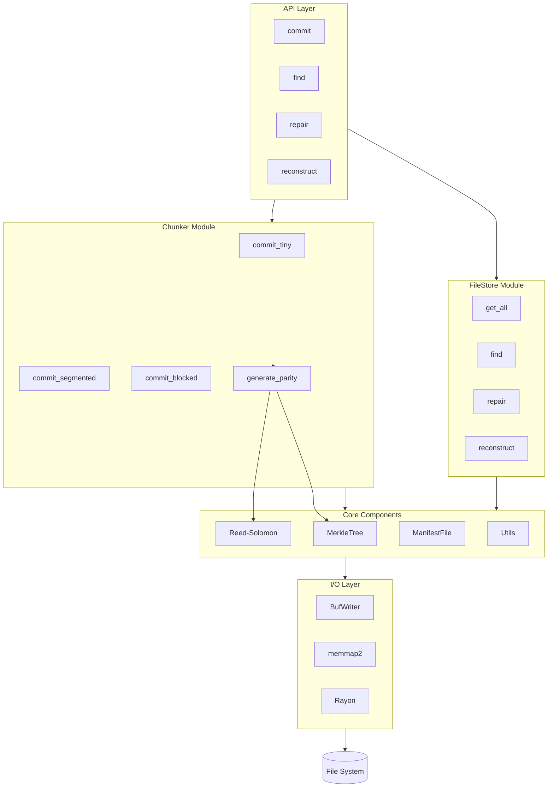
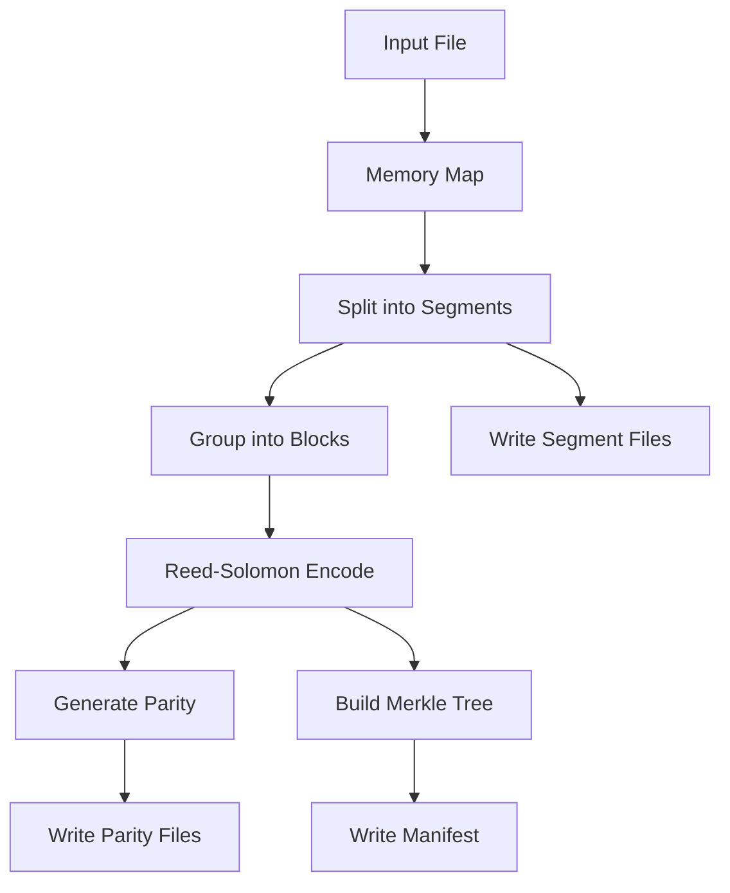
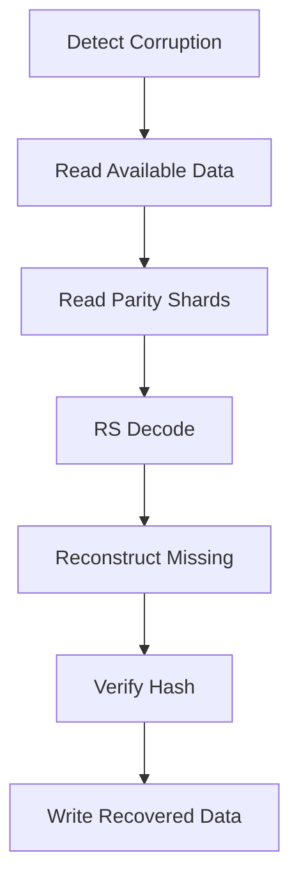
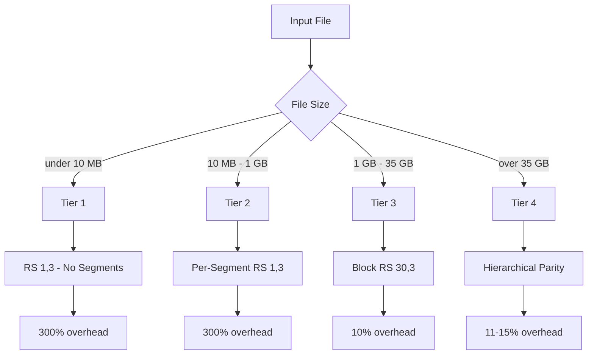
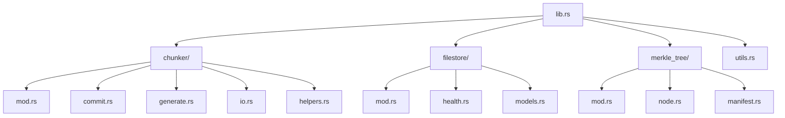

# BlockFrame-RS

**Self-healing, terabyte-scale archival storage built from first principles.**

BlockFrame is an erasure-coded storage system engineered to compete with enterprise data providers—without the enterprise price tag. It's designed for developers, data hoarders, and anyone who believes you should own and control your own data infrastructure.

> _"Get what you need, when you need it."_

---

## The Vision

Cloud storage providers charge you for capacity, egress, and availability. They hold your data hostage behind APIs, quotas, and unpredictable pricing. BlockFrame takes a different approach:

**House your own data.** Run your own infrastructure. Stream exactly the bytes you need without downloading entire files. Recover from hardware failures without backups. Pay once for hardware, not forever for access.

This isn't a wrapper around S3 or a database abstraction. This is a ground-up implementation of erasure-coded storage with:

- **Adaptive multi-tier architecture** that automatically selects optimal encoding strategies from kilobytes to terabytes
- **Reed-Solomon erasure coding** for self-healing without requiring original files
- **Merkle tree integrity verification** for O(log n) corruption detection
- **Memory-mapped I/O** for processing files larger than RAM
- **Parallel block processing** with Rayon for multi-core throughput

---

## Who This Is For

- **Self-hosters** tired of monthly storage bills
- **Data engineers** building cold storage pipelines
- **Archivists** preserving datasets that must survive hardware failures
- **Developers** who want to understand erasure coding at the implementation level
- **Anyone** who thinks paying per-GB for their own data is absurd

---

## Architecture Overview

### System Architecture



### Commit Flow



### Recovery Flow



### Tier Selection



### Module Structure



### Storage Layout

**Tier 1 (Tiny Files):**
```
archive_directory/{name}_{hash}/
├── data.dat
├── parity_0.dat
├── parity_1.dat
├── parity_2.dat
└── manifest.json
```

**Tier 2 (Medium Files):**
```
archive_directory/{name}_{hash}/
├── segments/
│   ├── segment_0.dat
│   ├── segment_1.dat
│   └── ...
├── parity/
│   ├── segment_0_parity_0.dat
│   ├── segment_0_parity_1.dat
│   └── ...
└── manifest.json
```

**Tier 3 (Large Files):**
```
archive_directory/{name}_{hash}/
├── blocks/
│   ├── block_0/
│   │   ├── segments/
│   │   │   ├── segment_0.dat ... segment_29.dat
│   │   └── parity/
│   │       ├── block_parity_0.dat
│   │       ├── block_parity_1.dat
│   │       └── block_parity_2.dat
│   └── block_1/
│       └── ...
└── manifest.json
```

BlockFrame uses a **4-tier adaptive architecture** that selects the optimal storage strategy based on file size:

| Tier       | Size Range | Strategy             | Overhead | Recovery Capability                      |
| ---------- | ---------- | -------------------- | -------- | ---------------------------------------- |
| **Tier 1** | <10MB      | RS(1,3)              | 300%     | Lose 2 of 3 parity, still recover        |
| **Tier 2** | 10MB-1GB   | Per-segment RS(1,3)  | 300%     | Per-segment recovery                     |
| **Tier 3** | 1GB-35GB   | Block-level RS(30,3) | 10%      | Lose 3 segments per block, still recover |
| **Tier 4** | >35GB      | Hierarchical parity  | 11-15%   | Multi-level fault tolerance              |

### The "Get What You Need" Innovation

Traditional storage systems force you to download entire files. BlockFrame's segmented architecture enables:

1. **Byte-range streaming** — Request segments 47-52 of a 10GB file without touching the rest
2. **Partial reconstruction** — Recover a single corrupted segment without reading the entire archive
3. **Incremental verification** — Verify integrity of specific segments in O(log n) time via Merkle proofs
4. **Parallel recovery** — Distribute repair work across multiple cores or machines

This is the foundation for a future HTTP file server that streams data with play/pause functionality, like video but for any file type.

---

## Performance Benchmarks

_Tested on Windows 11, HDD storage (sequential write ~88 MB/s)_

| Tier   | File Size | Encoding Time | Throughput |
| ------ | --------- | ------------- | ---------- |
| Tier 2 | 1GB       | 70.28s        | 14.23 MB/s |
| Tier 3 | 2GB       | 76.87s        | 26.02 MB/s |
| Tier 3 | 6GB       | 289.92s       | 20.70 MB/s |

**Note:** Performance is I/O bound on HDD. Reed-Solomon encoding itself takes only 1-4 seconds per block. On NVMe SSD, expect 150-200+ MB/s throughput.

---

## How It Works

### Commit Flow

```
Original File (6GB)
        ↓
   Memory-map (zero-copy read)
        ↓
   Segment into 32MB chunks
        ↓
   Group into blocks (30 segments/block)
        ↓
   Generate RS(30,3) parity per block
        ↓
   Build Merkle tree from block roots
        ↓
   Write manifest.json
        ↓
   Archive complete
```

### Recovery Flow

```
Detect missing/corrupt segment
        ↓
   Read remaining segments + parity
        ↓
   RS decode to reconstruct missing data
        ↓
   Verify against Merkle tree
        ↓
   Write recovered segment
        ↓
   Archive healed
```

---

## Storage Structure

### Tier 1 (Tiny Files)

```
archive_directory/{filename}_{hash}/
  data.dat              # Original file
  parity_0.dat          # Full file parity
  parity_1.dat
  parity_2.dat
  manifest.json
```

### Tier 2 (Medium Files)

```
archive_directory/{filename}_{hash}/
  segments/
    segment_0.dat
    segment_1.dat
    ...
  parity/
    segment_0_parity_0.dat
    segment_0_parity_1.dat
    segment_0_parity_2.dat
    ...
  manifest.json
```

### Tier 3 (Large Files)

```
archive_directory/{filename}_{hash}/
  blocks/
    block_0/
      segments/
        segment_0.dat ... segment_29.dat
      parity/
        block_parity_0.dat
        block_parity_1.dat
        block_parity_2.dat
    block_1/
      ...
  manifest.json
```

---

## Quick Start

```rust
use std::path::Path;
use blockframe::{chunker::Chunker, filestore::FileStore};

fn main() -> Result<(), Box<dyn std::error::Error>> {
    let chunker = Chunker::new()?;

    // Commit a file (tier auto-selected based on size)
    let result = chunker.commit(Path::new("my_dataset.bin"))?;
    println!("Archived: {} ({} segments)", result.file_name, result.num_segments);

    // Later: find and repair if needed
    let store = FileStore::new(Path::new("archive_directory"))?;
    let file = store.find(&"my_dataset.bin".to_string())?;
    store.repair(&file)?;

    Ok(())
}
```

---

## Core Components

### [`chunker`](src/chunker/)

The encoding engine. Handles file segmentation, Reed-Solomon parity generation, and Merkle tree construction. Stateless design—each commit is independent.

### [`filestore`](src/filestore/)

Archive management. Scans manifest files, provides file discovery, orchestrates repair and reconstruction operations.

### [`merkle_tree`](src/merkle_tree/)

Integrity verification. Builds hash trees from segments for O(log n) corruption detection and partial verification without full file reads.

### [`utils`](src/utils.rs)

Shared utilities. BLAKE3 hashing (SIMD-accelerated), dynamic segment sizing based on available memory.

---

## Engineering Decisions

### Why Reed-Solomon?

Reed-Solomon codes are the gold standard for erasure coding. They're used in CDs, DVDs, QR codes, RAID-6, and cloud storage systems. RS(k,n) can reconstruct any k missing shards from n total shards—mathematically guaranteed.

### Why BLAKE3?

10x faster than SHA-256 with equivalent security. SIMD-accelerated and parallelizable. The "sha256" function name is a legacy artifact—it's BLAKE3 under the hood.

### Why Memory-Mapped I/O?

Processing a 10GB file shouldn't require 10GB of RAM. Memory mapping lets the kernel manage page caching while we iterate through the file in segments. Zero-copy, constant memory.

### Why Rust?

No garbage collection pauses. Fearless concurrency with Rayon. Memory safety without runtime overhead. The performance characteristics of C with the ergonomics of modern languages.

---

## Roadmap

- [ ] HTTP file server with byte-range streaming
- [ ] Tier 4 hierarchical parity for 100GB+ files
- [ ] Async I/O with tokio for network operations
- [ ] Compression layer (LZ4/Zstd before encoding)
- [ ] Encryption (AES-256-GCM before encoding)
- [ ] Distributed storage across multiple machines
- [ ] S3-compatible API frontend

---

## License

MIT

---

## Acknowledgments

Built with:

- [`reed-solomon-simd`](https://github.com/AndersTrier/reed-solomon-simd) — SIMD-accelerated RS encoding
- [`blake3`](https://github.com/BLAKE3-team/BLAKE3) — Cryptographic hashing
- [`rayon`](https://github.com/rayon-rs/rayon) — Data parallelism
- [`memmap2`](https://github.com/RazrFalcon/memmap2-rs) — Memory-mapped I/O
- [`serde`](https://serde.rs/) — Serialization

---

_Engineered from first principles. No cloud dependencies. Your data, your infrastructure._
