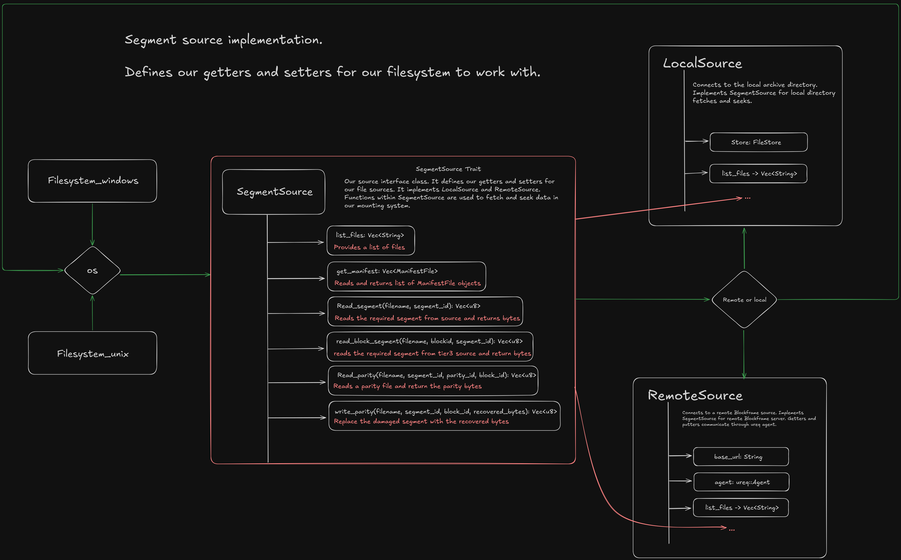

# Mount logic: the why.

- allows users to use their files that are chunked as if they're still attached
- removes the need to reconstruct the whole file
- removes the need to implement chunk streaming (os handles it for you)
- provides low level functionality

## The philosophy: The micro-manager vs the delegator

### Linux (the micro-manager)

The linux kernel treats filesystem drivers like interns. The kernel will manage all the caches, the permissions, the path lookups and the file descriptors. Therefore, the kernel will ask Fuse if for example inode 5 exists? Blockframe will then confirm that query. Because the kernel manages all the state (directory entry cache, inode cache, page cache), blockframe just has to answer simple questions. That is why getattr and lookup are so simple.

### Windows (the delegator)

to delegate means to pass a task or responsibility downwards, which is how windows works with its drivers. The windows kernel treats filesystem drivers like department heads. The kernel will receive a request to list files, and in response, will provide a 4kb memory buffer, it will not care how its done, as windows assumes the drives knows best. If an IRP request is received, it is the drivers responsibility to not panic and complete the given task, as windows assumes the drivers are in perfect working condition, therefore the kernel will not hold you hand at all. Which is why you're expected to manage your own directory buffers (`DirBuffer`), your own locking (`Arc<Mutex>`), and your own context (`FileContext`).

## The architectural mechanisms: inodes vs file objects

### Linux (the inode - stateless)

in linux, the filesystem is built around `Inode` (index node) which in reality is just a number (fun fact, run `ls -i` to see what inodes look like). Blockframe internally maps u64 -> filename as we'll already be educated in what files we'd have committed to blockframe. When later when linux asks for readdir, it will only ask for the entries of inode x. Therefore we wont need complex state in BlockframeFS, we can just look up the ID.

### Windows (the file object - stateful)

Windows is a bit different, windows is built around File Objects (handles, which is what our `BlockframeFileContext` struct is). When a user opens a directory in windows explorer, the kernel creates a `file object`. That object has a cursor which is more of a bookmark, and that bookmark is imperative for the functionality of our code. Windows works by using chunks of files which it'll display to the user. If we have a folder with 100,000 files, windows will not show all of those folders/files at once, what windows does is it fetches them in chunks, or whats called pages. Lets say a user has mounted blockframe, and opens up the file system's directory. There are files inside, and lets say they're more than a few hundred, when prompted to refresh the file list, windows will provide us with a 4kb buffer which we will fill up with our filenames. When the buffer is full, windows will show those files to the user. When windows asks us for the next chunk, without the bookmark we'd have no clue. What the cursor (bookmark) does simply, its just memory of where we left off in the pagination of our files.

However, in BlockframeFS, we dont actually utilise the cursor, we cheat a bit. WinFsp comes with a `DirBuffer` and what we do instead of calculating "okay the user wants 50-100 files" we just dump all of the files into the DirBuffer which acts like a smart middleman. DirBuffer holds the list in memory, it looks at the marker which is essentially another bookmark, and automatically slices the correct chunk of data to return to windows. If we didnt use DirBuffer, we'd have to manually increment and calculate our pages, waste valuable computation. Therefore our cursor is hardcoded at 0, because we'd want to atleast start from the top everytime.

This operation adds complexity when trying to replicate functionality from linux, we have to remember where the next 50 starts, not the kernel, the kernel is not that helpful on windows.

## The concurrency: packet storm vs queue

you might notice the `Arc<Mutex>` in the windows implimentation for inner, and the way simpler model in linux.

### Windows: the packet storm

Windows I/O is inherently Asychronous and parallel as it spawned in an era where computation was not affordable, but functional where as linux was made to be as small as possible compared to the available computation left on the computer after the operating system.

The windows I/O manager throws IRPS (I/O Request Packet) at the winfsp driver from multiple threads simultaneously. Thread A might be reading file.txt, thread B might be listing the directory, thread C might be asking for attributes. WinFSP exposes this raw concurrency, it calls Blockframe's methods such as `read`, `get_file_info` via the `&self` (shared reference). However, since multiple threads are inside the struct, we need to use an `Arc<Mutex<Inner>>` and this is done for multiple reasons. We have mutable data inside of our Inner, such as our cache and our HashMaps which will need to be mutable. If we didnt, two threads would try to update the cache at the same time, which will ultimately lead into a race condition and panic the software.

(visualising the interior mutability pattern: the `BlockframeFS` shell protecting the inner state)

### Linux: The queue

Standard FUSE is much simpler. Fuse can be multi-threaded but the library Fuser that we're using handles the serialisation or provides us with a `&mut self` interface, implying exclusive access for that specific operation, in contrast to windows' `&self`. really makes things easier to manage. The linux VFS serialises operations on the same inode in many cases. Basically, linux's kernel and the linux library we're using protects us from the chaos.

## How does it work

### Source.rs


(This diagram shows the path of a read request. It enters through the generic interface, hits our routing logic (the diamond), and is dispatched to the correct backend, either the local disk or the remote server.)

SegmentSource is a trait used to implement the getters and setters for our filesystems to read and seek files from a configured source. Blockframe natively supports both local source and remote source serving.

**LocalSource** targets the physical data stored in the configured `archive_directory` for the Blockframe instance.

**RemoteSource** facilitates a distributed storage model by using fast HTTP requests to fetch data from a remote Blockframe instance. Users can configure a Blockframe instance to serve files over the network, allowing other clients to connect via `RemoteSource`. This setup allows users to access their files remotely and shift the heavy storage burden to external servers, decoupling their local storage limitations from their data availability.

This functionality solves the problem of load shifting; however, it also allows for hardware specialization with mixed-priority data. Users can commit archival files to remote sources on slower, cold storage hardware, while keeping high-traffic files on faster remote hardware for optimal read/write performance. Blockframe is ultimately limited only by the hardware itself.

### Cache.rs

We cant just be constantly reading from disk or network, that would be insane. So we cache segments. But not with LRU (Least Recently Used), which is what everyone reaches for first and so did I. We use **W-TinyLFU** (Window Tiny Least Frequently Used) via the `moka` crate because LRU has a fatal flaw: **scan intolerance**.

### The VLC Problem (why LRU fails for filesystems)

Picture this: You stream a 25GB video file through VLC on a system with a 5GB cache. With LRU, every segment you read is marked as "most recently used" and protected. But you're reading the video linearly, segment 0, segment 1, segment 2... and you'll never rewind. These are **one-hit wonders**, data read once and never again.

**What LRU does (the disaster):**

1. User requests `segment_100.dat` from movie.mp4
2. LRU says "this is important, protect it!" and evicts `metadata_root_dir` (actually important, accessed constantly)
3. User requests `segment_101.dat`
4. LRU evicts `segment_100.dat` (which you just loaded)
5. Repeat 1000 times

Result: Your cache is churning at 100% turnover. You're not just failing to cache the video (which is fine, sequential reads dont need caching), you're actively destroying the cache by evicting high-value data like directory listings, manifests, and small frequently-accessed files. This is called **cache pollution**.

**What W-TinyLFU does (the smart way):**
W-TinyLFU has a "doorkeeper" that asks: "Is this item frequently accessed?" When `segment_100` arrives, the cache says "No? Then I won't let you evict my important data." It puts streaming segments into a small "probation window." If they aren't accessed again (which they won't be), they fall out immediately. The core "frequent items" cache stays untouched. Your metadata, manifests, and hot segments stay cached. The video segments pass through without pollution.

### Why moka specifically?

```rust
pub struct SegmentCache {
    cache: Cache<String, Arc<Vec<u8>>>,
    max_bytes: u64,
}
```

The `moka` crate gives us W-TinyLFU with built-in byte-level weighing. No manual eviction loops, no tracking `current_bytes` in a while loop, no fragile accounting. You tell moka how much each item weighs (segment size), and it handles eviction automatically based on both frequency and size.

The cache uses `Arc<Vec<u8>>` which is critical. When we return cached data, we return a reference-counted pointer. This means the filesystem can hold onto segment data while reading it, but the cache can still evict it if needed. The Arc keeps the data alive until the read completes. Without Arc, we'd have to copy the data (slow) or risk the cache pulling the rug out from under an active read (crash).

**Eviction strategy:**
When we need space for a new segment, moka automatically evicts based on W-TinyLFU's frequency+recency algorithm. Items with low access frequency get evicted first. Items accessed once (like streaming video) don't pollute the cache. No manual loops, O(1) operations, thread-safe.

**Key format:**
Cache keys are `"filename:segment_id"` so segment 47 of `movie.mp4` is `"movie.mp4:47"`. Simple, unique, human-readable for debugging.

**The edge case:**
What if a single segment is larger than `max_bytes`? We log a warning and skip caching it. Better to be slow than to thrash the cache trying to fit a whale through a keyhole.

### Filesystem implementations: the actual drivers

Both Windows and Linux implementations follow the same pattern: receive OS requests, translate them to `SegmentSource` calls, cache the results, serve the data. But the devil is in the details.

#### filesystem_unix.rs (FUSE)

Linux gives us a simple contract: implement the `Filesystem` trait from fuser, answer questions about inodes, done.

**Key operations:**

- `lookup`: "Does inode 5 exist?" → check our `inode_to_filename` map, return attributes if exists
- `readdir`: "List files in directory inode 1" → iterate all files, return `(inode, filename)` pairs
- `open`: "Open file for reading" → create a file handle, store it in `open_files` map
- `read`: "Read N bytes at offset O from file handle H" → calculate which segments we need, fetch them, copy bytes, done

**Inode management:**
We start at inode 2 (1 is root) and increment for each file. The maps `inode_to_filename` and `filename_to_inode` are bidirectional lookups. Inodes are permanent for the mount session, once assigned, they dont change.

**Segment reading logic:**
The tier system kicks in here. Tier 1 files? Read the whole `data.dat`. Tier 2? Read `segment_N.dat`. Tier 3? Calculate block index (segment_id / 30), then read from `block_X/segments/segment_Y.dat`. The cache layer sits below this, so we dont care if its cached or not, call `read_from_source()` and let the cache handle it.

**Recovery on the fly:**
If a segment read fails or the hash doesnt match, we call `recover_segment()` which fetches parity shards and uses Reed-Solomon decoding to reconstruct the missing data. This is transparent to the user, they just see a slight delay on that read. The recovered segment gets written back to disk for next time.

#### filesystem_win.rs (WinFSP)

Windows is the wild west. WinFSP gives us `&self` (shared reference) for all operations, meaning multiple threads can call `read()` simultaneously. Hence the `Arc<Mutex<Inner>>` armor.

**Key operations:**

- `get_security_by_name`: "What are the attributes for this path?" → check if its root or a file, return security descriptor
- `open`: "Open a file or directory" → create `BlockframeFileContext`, init `DirBuffer` if its root
- `read`: "Read bytes at offset" → lock inner, calculate segments, fetch, copy, unlock
- `read_directory`: "List directory contents" → dump all files into `DirBuffer`, let it handle pagination
- `get_file_info`: "Get file metadata" → return cached `FileInfo` from manifest

**The DirBuffer trick:**
Windows wants to paginate directory listings (show 50 files, then next 50, etc.). But we dont want to track pagination state ourselves as it would just add memory overhead. So we cheat: on first `read_directory` call, we dump ALL files into `DirBuffer`. DirBuffer is a WinFSP helper that holds the full list and automatically slices the correct chunk based on the `marker` Windows provides. We set our cursor to 0 because DirBuffer handles everything. This is like having an intelligent worker who sorts your mail, you dont need to remember which pile you were on.

**Concurrency management:**
Every operation locks `inner` via `Mutex`. This is coarse-grained locking (one lock for the whole filesystem), but its fine because operations are fast, mostly just map lookups and cache checks. The actual I/O happens inside the lock too, but the cache makes this rare. We could get fancier with per-file locks or RwLock, but that adds complexity for marginal gain. chose to keep it simple.

**Arc drops in read():**
The `read()` function has a subtle scope trick. We fetch the segment Arc, copy the data to the buffer, then immediately drop the Arc by exiting the scope. This keeps the reference count low so the LRU cache can evict segments when needed. If we held Arc across operations, we'd leak memory via circular references.

## The serve layer: remote mounting

The serve module turns a Blockframe instance into a file server. This is what RemoteSource talks to.

**How it works:**

1. Run `blockframe serve --port 8080` on machine A (has the archive)
2. Run `blockframe mount --remote http://machine-a:8080` on machine B (wants to access files)
3. Machine B's BlockframeFS uses `RemoteSource` which makes HTTP requests to machine A
4. Machine A's serve layer (Poem web framework) handles requests and returns data from its local `FileStore`

**API endpoints:**

- `GET /api/files` → list all files (returns JSON array of `FileInfo`)
- `GET /api/files/{filename}/manifest` → get manifest (returns parsed `ManifestFile`)
- `GET /api/files/{filename}/segment/{id}` → get tier 2 segment bytes
- `GET /api/files/{filename}/block/{block}/segment/{id}` → get tier 3 segment bytes
- `GET /api/files/{filename}/parity/?segment_id=X&parity_id=Y` → get parity shard
- `GET /api/files/{filename}` → get tier 1 data.dat (whole file)

**Response format:**
Segments and parity return raw bytes (`Binary<Vec<u8>>`). Manifests return JSON. Simple and fast.

**RemoteSource implementation:**
Just wraps these HTTP calls. When mount asks for segment 47 of `movie.mp4`, RemoteSource does `GET http://server/api/files/movie.mp4/segment/47` and returns the bytes. The ureq HTTP client handles connection pooling and retries.

**Performance considerations:**
Network latency is the killer here. Local disk read is ~100ms for 32MB segment. Network read over gigabit ethernet is ~250ms for same segment (throughput is fine, latency is 2.5x higher). This is why the cache is crucial, once a segment is cached, subsequent reads are microseconds, not milliseconds.

**Why not NFS or SMB?**
Because we want to expose the blockframe-specific API (parity shards, manifests, tier-aware routing). NFS would just expose raw files, losing all the smart recovery logic. With our HTTP API, the remote client can do Reed-Solomon recovery by fetching parity shards, cant do that over NFS without reading all the files. However, a local Blockframe node can expose the filesystem to the network through SMB without users requiring thier own Blockframe instance running.

## The full read path: start to finish

Lets trace a real read request: user runs `cat movie.mp4` on a mounted Blockframe filesystem.

**Step 1: OS issues read**
The shell calls `read(fd, buffer, size, offset)`. The kernel sees this is a FUSE/WinFSP mount, so it redirects to our driver.

**Step 2: Calculate segments**
We divide offset by segment_size to find which segment(s) we need. For a 100MB file with 32MB segments:

- Offset 0 → segment 0
- Offset 50MB → segment 1
- Offset 70MB → segment 2

**Step 3: Check cache**
For each segment, we call `cache.get("movie.mp4:1")`. If hit, skip to step 6.

**Step 4: Fetch from source**
Cache miss, so we call `source.read_segment("movie.mp4", 1)`.

**Step 4a: Local path**
LocalSource looks up the file in FileStore, gets the segment path (`archive/movie.mp4_hash/segments/segment_1.dat`), reads it with `fs::read()`, returns bytes.

**Step 4b: Remote path**
RemoteSource makes HTTP request `GET http://server/api/files/movie.mp4/segment/1`, waits for response, returns bytes.

**Step 5: Cache update**
Wrap the bytes in Arc, insert into cache with `cache.put("movie.mp4:1", arc_bytes)`. If cache is full, evict LRU segments first.

**Step 6: Copy to buffer**
Calculate offset within segment, copy the requested bytes to the output buffer. If read spans multiple segments, loop back to step 3 for next segment.

**Step 7: Return to OS**
Tell the kernel "I read N bytes successfully". Kernel copies our buffer to userspace, returns to the `cat` command. User sees their data.

**Total time (local, cached):** ~10 microseconds  
**Total time (local, uncached):** ~100 milliseconds  
**Total time (remote, uncached):** ~250 milliseconds

## Troubleshooting

**"Transport endpoint not connected" on Linux**
FUSE crashed or mount point is stale. Run `fusermount -u /mnt/blockframe` then remount.

**Windows shows empty directory**
`read_directory` might have failed silently. Check logs. Or manifests arent loading, verify `archive_directory` path is correct.

**Reads are slow**
Cache is too small or youre hitting remote source over high-latency network. Increase cache size in `config.toml` or use local archive.

**File shows wrong size**
Manifest is corrupt or out of sync. Run `blockframe repair` to fix.

**Segmentation fault / panic in read()**
Probably a bounds check failure in segment calculation. File a bug with the file size, offset, and segment size.

## Future improvements

- **Prefetching:** When segment N is read, speculatively fetch N+1 in background (sequential reads)
- **Write support:** Currently read-only. Write would need to rechunk, regenerate parity, update Merkle tree
- **Distributed parity:** Fetch parity shards from multiple servers for redundancy
- **mmap support:** Let kernel map segments directly instead of copying through read()
- **Lazy manifest loading:** Dont parse all manifests at mount time, load on first access

---

_For implementation details on chunking, see [chunker/README.md](../chunker/README.md)_  
_For recovery operations, see [filestore/README.md](../filestore/README.md)_  
_For Merkle tree verification, see [merkle_tree/README.md](../merkle_tree/README.md)_
