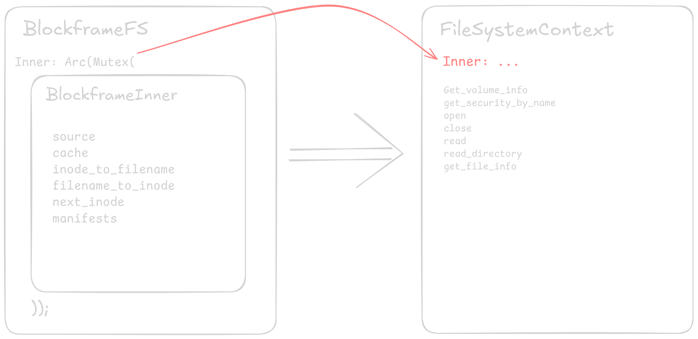

# Mount logic: the why.

## The philosophy: The micro-manager vs the delegator

### Linux (the micro-manager)

The linux kernel treats filesystem drivers like interns. The kernel will manage all the caches, the permissions, the path lookups and the file descriptors. Therefore, the kernel will ask Fuse if for example inode 5 exists? Blockframe will then confirm that query. Because the kernel manages all the state (directory entry cache, inode cache, page cache), blockframe just has to answer simple questions. That is why getattr and lookup are so simple.

### Windows (the delegator)

to delegate means to pass a task or responsibilty downwards, which is how windows works with its dirivers. The windows kernel treats filesystem drivers like department heads. The kernel will recieve a request to list files, and in response, will provide a 4kb memory buffer, it will not care how its done, as windows assumes the drives knows best. If an IRP request is recieved, it is the drivers responsibility to not panic and complete the given task, as windows assumes the drivers are in perfect working condition, therefore the kernel will not hold you hand at all. Which is why you're expected to manage your own directory buffers (`DirBuffer`), your own locking (`Arc<Mutex>`), and your own context (`FileContext`).

## The architectural mechanisms: inodes vs file objects

### Linux (the inode - stateless)

in linux, the filesystem is built around `Inode` (index node) which in reality is just a number (fun fact, run `ls -i` to see what inodes look like). Blockframe internally maps u64 -> filename as we'll already be educated in what files we'd have commited to blockframe. When later when linux asks for readdir, it will only ask for the entries of inode x. Therefore we wont need complex state in BlockframeFS, we can just look up the ID.

### Windows (the file object - stateful)

Windows is a bit different, windows is built around File Objects (handles, which is what our `BlockframeFileContext` struct is). When a user opens a directory in windows explorer, the kernel creates a `file object`. That object has a cursor which is more of a bookmark, and that bookmark is imperative for the functionality of our code. Windows works by using chunks of files which it'll display to the user. If we have a folder with 100,000 files, windows will not show all of those folders/files at once, what windows does is it fetches them in chunks, or whats called pages. Lets say a user has mounted blockframe, and opens up the file system's directory. There are files inside, and lets say they're more than a few hundred, when prompted to refresh the file list, windows will provide us with a 4kb buffer which we will fill up with our filenames. When the buffer is full, windows will show those files to the user. When windows asks us for the next chunk, without the bookmark we'd have no clue. What the cursor (bookmark) does simply, its just memory of whree we left off in the pagination of our files.

However, in BlockframeFS, we dont actually utilise the cursor, we cheat a bit. WinFsp comes with a `DirBuffer` and what we do instead of calculating "okay the user wants 50-100 files" we just dump all of the files into the DirBuffer which acts like a smart middleman. DirBuffer holds the list in memory, it looks at the marker which is essentially another bookmark, and automatically slices the correct chunk of data to return to windows. If we didnt use DirBuffer, we'd have to manually increment and calculate our pages, waste valuable computation. Therefore our cursor is hardcoded at 0, because we'd want to atleast start from the top everytime.

This operation adds complexity when trying to replicate functionality from linux, we have to remember where the next 50 starts, not the kernel, the kernel is not that helpful on windows.

## The concurrency: packet storm vs queue

you might notice the `Arc<Mutex>` in the windows implimentation for inner, and the way simpler model in linux.

### Windows: the packet storm

Windows I/O is inherently Asychronous and parallel as it spawned in an era where computation was not affordable, but functional where as linux was made to be as small as possible compared to the available computation left on the computer after the operating system.

The windows I/O manager throws IRPS (I/O Request Packet) at the winfsp driver from multiple threads simultaneously. Thread A might be reading file.txt, thread B might be listing the directory, thread C might be asking for attributes. WinFSP exposes this raw concurrency, it calls Blockframe's methods such as `read`, `get_file_info` via the `&self` (shared reference). However, since multiple threads are inside the struct, we need to use an `Arc<Mutex<Inner>>` and this is done for multiple reasons. We have mutable data inside of our Inner, such as our cache and our HashMaps which will need to be mutable. If we didnt, two threads would try to update the cache at the same time, which will ultimately lead into a race condition and panic the software.

(visualising the interior mutability pattern: the `BlockframeFS` shell protecting the inner state)

### Linux: The queue

Standard FUSE is much simpler. Fuse can be multi-threaded but the library Fuser that we're using handles the serialisation or provides us with a `&mut self` interface, implying exclusive access for that specific operation, in contrast to windows' `&self`. really makes things easier to manage. The linux VFS serialises operations on the same inode in many cases. Basically, linux's kernel and the linux library we're using protects us from the chaos.
